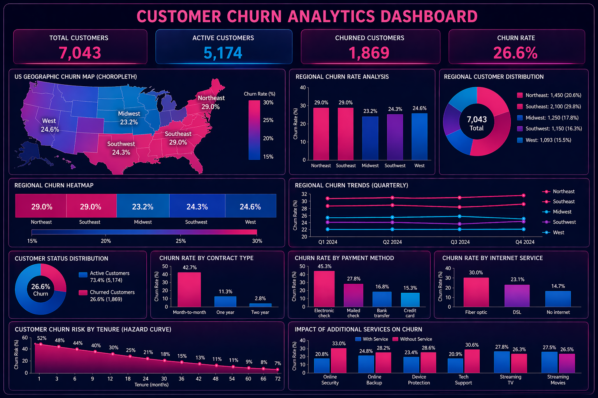

# 📊 FUTURE_DS_02 – Customer Churn Analysis

## 📌 Project Overview

This project analyzes customer churn in a subscription-based telecommunications business to understand why customers leave and how retention can be improved.

---

## 🎯 Objective

* Identify key drivers of churn
* Analyze customer behavior patterns
* Provide actionable retention strategies

---

## 🛠️ Tools Used

* R (Data Cleaning)
* Excel / Analysis
* Visualization (Dashboard Image)

---

## 📊 Dataset

A cleaned version of the Telco Customer Churn dataset is included in this repository.

---

## 🧹 Data Cleaning

Performed using R:

* Handled missing values
* Converted variables
* Removed duplicates
* Created customer segments

---

## 📈 Dashboard Visualization

This dashboard presents a visual summary of churn insights derived from the analysis.

---

## 🔍 Key Insights

* Month-to-month contracts have the highest churn
* Long-term contracts significantly reduce churn
* Electronic payment users churn more
* Early-stage customers are at highest risk
* Additional services improve retention

---

## 💡 Recommendations

* Encourage long-term subscriptions
* Improve onboarding experience
* Promote auto-payment
* Bundle additional services
* Review pricing strategies

---

## 👤 Author

Busisiwe Motlhale
Data Science & Analytics Intern
